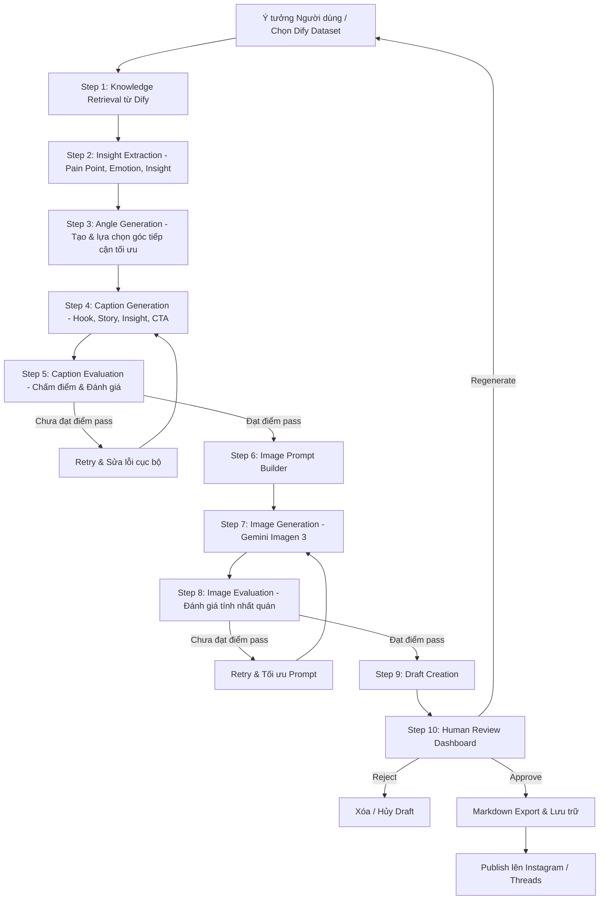

# Tổng Quan Hệ Thống Unified Content Agent

Tài liệu này cung cấp cái nhìn toàn diện về dự án **Unified Content Agent** (hay **AgentOS Content Studio**), bao gồm kiến trúc hệ thống, sơ đồ workflow, cách thức hoạt động chi tiết và hướng dẫn chạy dự án.

---

## 1. Giới thiệu Dự án

**Unified Content Agent** là một hệ thống **AI Content Pipeline** chạy cục bộ (local). Dự án được thiết kế nhằm giúp các cá nhân, người làm nội dung hoặc đội nhóm nhỏ tự động hóa quy trình sản xuất nội dung chất lượng cao đăng tải lên mạng xã hội (Instagram, Threads). 

Hệ thống hoạt động như một trợ lý tự động hóa:
* **Thu thập tri thức:** Kết nối với cơ sở tri thức (Dataset) từ Dify.
* **Tự động sáng tạo:** Lập kế hoạch, chọn góc tiếp cận (Angle), tự động viết Caption và thiết kế Prompt để tạo hình ảnh.
* **Tự động đánh giá chất lượng (AI Evaluation):** Sử dụng các tiêu chí chấm điểm và vòng lặp tự động sửa lỗi (Self-Correction/Retry) cục bộ để tiết kiệm token và đảm bảo chất lượng.
* **Quyền kiểm duyệt của con người (Human-in-the-loop):** Cung cấp Dashboard giao diện thân thiện cho phép người dùng xem trước, sửa đổi, phê duyệt (Approve), từ chối (Reject) hoặc sinh lại nội dung trước khi xuất bản.
* **Đăng tải trực tiếp:** Kết nối với API của Meta để đăng tải tự động lên Instagram và Threads.

---

## 2. Sơ đồ Workflow Hoạt động

Dưới đây là quy trình hoạt động tuần tự của hệ thống từ khi nhận ý tưởng đầu vào cho tới khi đăng tải lên mạng xã hội:



---

## 3. Cách thức Hoạt động Chi tiết

### Bước 1: Knowledge Retrieval (Dify)
Hệ thống sử dụng Dify API để tìm kiếm ngữ cảnh liên quan từ tài liệu hoặc sách tri thức có sẵn dựa trên ý tưởng của người dùng.

### Bước 2: Insight Extraction
AI phân tích các tài liệu tri thức lấy được để rút ra 3 yếu tố cốt lõi:
1. **Pain Point:** Vấn đề/nỗi đau nhức nhối của độc giả.
2. **Emotion:** Cảm xúc chủ đạo đi kèm.
3. **Insight:** Sự thật ngầm hiểu hoặc giải pháp đắt giá.

### Bước 3: Angle Generation
AI tạo ra nhiều góc viết bài khác nhau. Sau đó, nó tự động chọn ra góc tiếp cận tốt nhất để hướng bài viết đi đúng trọng tâm và thu hút nhất.

### Bước 4 & 5: Caption Generation & Evaluation (Vòng lặp tự sửa)
* Bài viết được viết theo cấu trúc chuẩn: **Hook (Tiêu đề cuốn hút) → Story (Câu chuyện dẫn dắt) → Insight (Giá trị cốt lõi) → CTA (Lời kêu gọi hành động)**.
* Hệ thống AI Evaluator sẽ tiến hành chấm điểm bài viết. 
* **Self-Correction:** Nếu điểm số dưới ngưỡng thiết lập (ví dụ: CTA yếu), hệ thống sẽ chỉ yêu cầu AI chỉnh sửa riêng phần CTA đó thay vì viết lại toàn bộ caption, giúp giữ lại các phần tốt và tiết kiệm chi phí token.

### Bước 6, 7 & 8: Image Prompt Builder & Image Generation
* Từ nội dung bài viết đã hoàn thiện, AI tạo ra một Prompt sinh ảnh tối ưu.
* Hệ thống gọi **Google Gemini API (Imagen 3)** để tạo ảnh thực tế định dạng Base64.
* Ảnh cũng trải qua một vòng đánh giá (Image Evaluation) về tính nhất quán phong cách (Composition, Style, Color).

### Bước 9 & 10: Review Dashboard & Publish
* Bản nháp hoàn chỉnh (Draft) được hiển thị trên giao diện Next.js.
* Sau khi người dùng duyệt (**Approve**), hệ thống tự động xuất bản (Publish) lên Instagram và Threads bằng API Graph của Meta.

---

## 4. Hướng dẫn Chạy Hệ thống (How to Run)

### A. Chuẩn bị biến môi trường (Environment Variables)

Tại thư mục `backend/.env`, hãy cấu hình các khóa API của bạn:

```env
# API Key của NVIDIA (sử dụng cho LLM văn bản / chấm điểm)
NVIDIA_API_KEY=nvapi-...

# API Key của Gemini (sử dụng cho tạo ảnh Imagen 3)
GEMINI_API_KEY=AQ...

# Cấu hình Dify Knowledge Base
DIFY_API_KEY=app-...
DIFY_API_URL=https://api.dify.ai/v1

# Token mạng xã hội Meta (Instagram & Threads)
INSTAGRAM_ACCESS_TOKEN=IGAA...
INSTAGRAM_USER_ID=3615...
THREADS_ACCESS_TOKEN=THAA...
THREADS_USER_ID=2713...
```

---

### B. Chạy Backend (FastAPI)

1. Mở terminal mới và di chuyển tới thư mục `backend`:
   ```bash
   cd backend
   ```
2. Kích hoạt môi trường ảo:
   * **Linux/macOS:**
     ```bash
     source .venv/bin/activate
     ```
   * **Windows (Command Prompt):**
     ```cmd
     .venv\Scripts\activate
     ```
3. Chạy server phát triển (development server):
   ```bash
   python -m uvicorn src.main:app --port 8000 --reload
   ```
   * *API docs sẽ có sẵn tại: `http://localhost:8000/docs`*

---

### C. Chạy Frontend (Next.js)

1. Mở một terminal khác và di chuyển tới thư mục `frontend`:
   ```bash
   cd frontend
   ```
2. Cài đặt các thư viện cần thiết (nếu là lần đầu tiên chạy):
   ```bash
   npm install
   ```
3. Chạy ứng dụng Next.js ở môi trường phát triển:
   ```bash
   npm run dev
   ```
   * *Giao diện người dùng sẽ có sẵn tại: `http://localhost:3000`*
